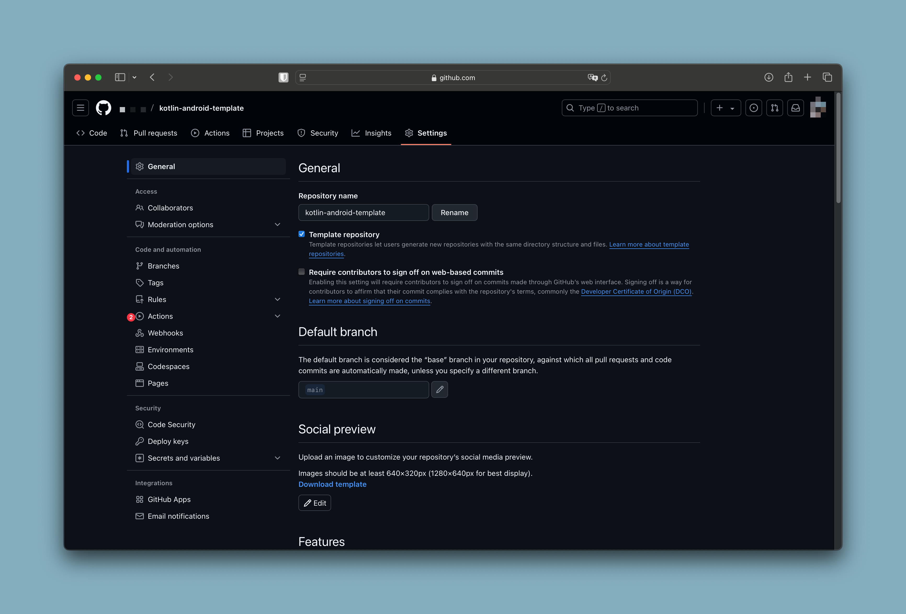

# agp incompatibility with IntelliJ IDEA

Opening this template in IDEA might result in an error like this:

```
The project is using an incompatible version (AGP 8.0.0) of the Android Gradle plugin. Latest supported version is AGP 7.4.0
```

This is caused by IDEA support for AGP lagging behind releases of AGP and is tracked by bugs like https://youtrack.jetbrains.com/issue/IDEA-317997.

To get this working in the mean time, you can downgrade the version of `agp` in `libs.versions.toml` to a supported version. 

# Use correct JVM version

This template requires you to have the correct JDK version in your path. Check which version you have by running `java --version` in a terminal. This should match the version specified in the Gradle build files e.g.:
```
    kotlinOptions {
        jvmTarget = JavaVersion.VERSION_17.toString()
    }
```
If you use a JVM which is too new, you may see an error like this:
```
FAILURE: Build failed with an exception.
* What went wrong:
Execution failed for task ':library-compose:detekt'.
> Invalid value (20) passed to --jvm-target, must be one of [1.6, 1.8, 9, 10, 11, 12, 13, 14, 15, 16, 17, 18]
```

# Template Cleanup fails in first Workflow

If the error occurs in the **Push changes** step of the workflow and you encounter errors such as:

```
fatal: unable to access 'https://github.com/<username>/<repo>.git/':
The requested URL returned error: 403 
Error: Invalid exit code: 128
```

then the issue is likely due to the workflow permissions of your repository. To resolve this, navigate to your repository settings, go to **Actions -> General**, and set the Workflow Permissions to **Read and Write**.

<p align="center">
  <br>
  <br>
  <br>
  <br>
</p>


Once the workflow completes successfully, you can and probably should revert the permissions back to the default settings.
